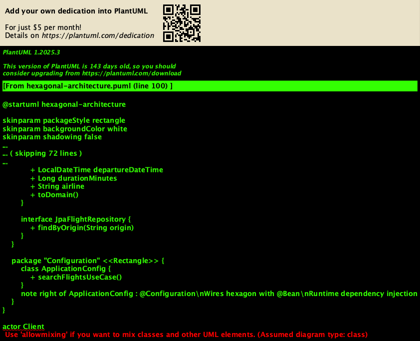
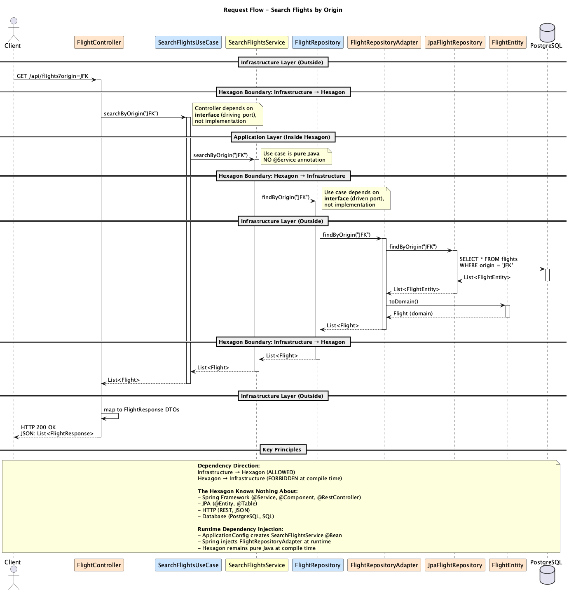
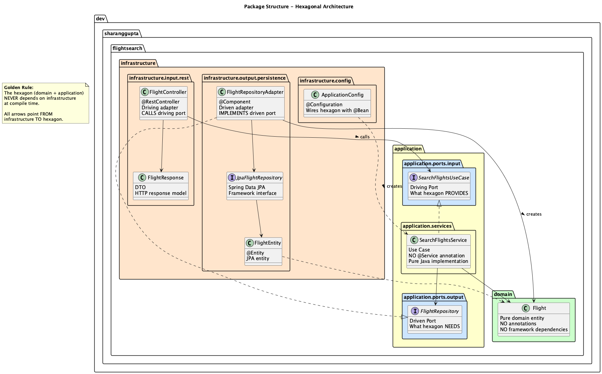

# Flight Search API

[](https://github.com/sharanggupta/flight-search/actions/workflows/ci.yml)
[](https://openjdk.org/projects/jdk/21/)
[](https://spring.io/projects/spring-boot)
[](LICENSE)

A Spring Boot REST API for searching flights, built using **Test-Driven Development (TDD)** and **true Hexagonal Architecture** principles.

## Table of Contents

- [Architecture](#architecture)
- [Technologies](#technologies)
- [Quick Start](#quick-start)
- [Running Tests](#running-tests)
- [API Documentation](#api-documentation)
- [Development Workflow](#development-workflow)
- [Architecture Diagrams](#architecture-diagrams)
- [Project Structure](#project-structure)

## Architecture

This project implements **true Hexagonal Architecture** (Ports and Adapters pattern) following the principle that **the hexagon never depends on the outside at compile time**.

### The Golden Rule

> The hexagon (domain + application) NEVER depends on infrastructure at compile time.

### Architecture Overview



**Key Concepts:**

- **Inside the Hexagon**: Domain + Application layers (pure Java, NO Spring dependencies)
- **Outside the Hexagon**: Infrastructure layer (ALL framework code - Spring, JPA, REST, etc.)

**Ports & Adapters:**

- **Driving Ports (Input)**: Interfaces defining what the hexagon PROVIDES → Called by driving adapters
- **Driven Ports (Output)**: Interfaces defining what the hexagon NEEDS → Implemented by driven adapters
- **Driving Adapters**: REST controllers that CALL use cases (don't implement them)
- **Driven Adapters**: JPA repositories that IMPLEMENT ports (don't call them)

### Request Flow



The diagram above shows how a request flows through the hexagonal architecture:

1. **Client** → Driving Adapter (FlightController)
2. **Driving Adapter** → Driving Port (SearchFlightsUseCase interface)
3. **Use Case** → Driven Port (FlightRepository interface)
4. **Driven Port** → Driven Adapter (FlightRepositoryAdapter)
5. **Driven Adapter** → Database (via JPA)

**Note:** The hexagon (use case) depends only on interfaces, never on infrastructure implementations.

### Package Structure



```
src/main/java/dev/sharanggupta/flightsearch/
├── domain/                           # INSIDE HEXAGON - Pure business entities
│   └── Flight.java                  # Domain model - NO framework dependencies
│
├── application/                      # INSIDE HEXAGON - Application layer
│   ├── ports/                       # Port interfaces (boundaries)
│   │   ├── input/                   # Driving ports (use cases)
│   │   │   └── SearchFlightsUseCase.java
│   │   └── output/                  # Driven ports (dependencies)
│   │       └── FlightRepository.java
│   └── services/                    # Use case implementations (NO @Service!)
│       └── SearchFlightsService.java
│
└── infrastructure/                   # OUTSIDE HEXAGON - Infrastructure layer
    ├── config/                      # Spring wiring
    │   └── ApplicationConfig.java   # @Configuration - wires hexagon at runtime
    ├── input/                       # Driving adapters (call the hexagon)
    │   └── rest/
    │       ├── FlightController.java        # @RestController
    │       └── FlightResponse.java
    └── output/                      # Driven adapters (implement ports)
        └── persistence/
            ├── FlightEntity.java            # @Entity
            ├── JpaFlightRepository.java     # Spring Data JPA
            └── FlightRepositoryAdapter.java # @Component
```

### Why This Matters

**Traditional Layered Architecture Problems:**
- ❌ Business logic depends on framework (@Service annotations)
- ❌ Hard to test without Spring
- ❌ Difficult to swap frameworks
- ❌ Unclear boundaries

**Hexagonal Architecture Benefits:**
- ✅ Business logic is pure Java (NO framework dependencies)
- ✅ Easy to test without Spring (use case tests run fast)
- ✅ Can swap frameworks easily (only infrastructure changes)
- ✅ Clear boundaries enforced at compile time
- ✅ Domain-driven design friendly

### Architecture FAQ

**Q: Why not use `@Service` on use cases?**
A: That creates a framework dependency in the application layer, violating the golden rule. Instead, we use `@Bean` in the infrastructure config layer.

**Q: Won't manual `@Bean` configuration get out of hand?**
A: Yes, it will grow - but this is the *correct* trade-off for architectural purity. The cost is worth the benefits of true framework independence.

**Q: Is this overkill for a simple application?**
A: For CRUD apps, yes. For complex business logic that needs to evolve independently of frameworks, no. This architecture shines when business complexity increases.

See [HEXAGONAL_ARCHITECTURE_REFACTORING.md](HEXAGONAL_ARCHITECTURE_REFACTORING.md) for detailed explanation of the architecture decisions.

## Technologies

- **Java 21** (LTS) - Latest LTS version with records, pattern matching
- **Spring Boot 3.4.0** - Latest Spring Boot release
- **PostgreSQL** - Production database
- **TestContainers** - Real database for E2E tests (not H2!)
- **Maven** - Build tool
- **JUnit 5** - Testing framework
- **Spring WebFlux** (WebTestClient) - E2E HTTP testing
- **Lombok** - Boilerplate reduction
- **Docker & Docker Compose** - Local development environment

## Quick Start

### Prerequisites
- **Java 21** (verify: `java -version`)
- **Docker & Docker Compose** (verify: `docker --version`)
- **Maven 3.6+** (or use `./mvnw`)

### Run the Application

**Option 1: Local Development (Recommended)**

App runs locally with hot reload, database in Docker:

```bash
./scripts/start-local.sh
```

This automatically:
- ✅ Starts PostgreSQL container (port 5433)
- ✅ Initializes database with 10 sample flights
- ✅ Runs Spring Boot app with `local` profile
- ✅ Enables debug logging and SQL output

**Option 2: Full Docker Stack (Production-like)**

Everything runs in Docker containers:

```bash
./scripts/start-docker.sh
```

**Option 3: Manual Control**

```bash
# Start only PostgreSQL
docker-compose -f docker/docker-compose.yml up -d postgres

# Run application
./mvnw spring-boot:run -Dspring-boot.run.profiles=local

# Or run full stack
docker-compose -f docker/docker-compose.yml up --build
```

### Stop Services

```bash
./scripts/stop.sh

# Or manually
docker-compose -f docker/docker-compose.yml down

# Remove database volume (fresh start)
docker-compose -f docker/docker-compose.yml down -v
```

**Note:** PostgreSQL runs on port **5433** (not 5432) to avoid conflicts with local installations.

## Running Tests

### Unit Tests Only (Fast!)
```bash
./mvnw test -Dtest="!E2E*"
```

These run in **milliseconds** because they don't need Spring or Docker - the hexagon is pure Java!

### E2E Tests Only
```bash
./mvnw test -Dtest="E2E*"
```

These spin up TestContainers with real PostgreSQL and full Spring Boot context.

### All Tests
```bash
./mvnw test
```

### Continuous Integration

The project uses GitHub Actions for automated testing on every push:

1. **Unit Tests** - Fast, isolated tests (no Docker required)
2. **E2E Tests** - Full integration tests with TestContainers
3. **Build** - Creates JAR artifact

Test results are automatically published and visible in PR checks. View the [Actions tab](https://github.com/sharanggupta/flight-search/actions) for detailed reports.

## API Documentation

### Search Flights by Origin

```http
GET /api/flights?origin={airportCode}
```

**Example Requests:**

```bash
# Flights from New York JFK
curl http://localhost:8080/api/flights?origin=JFK

# Flights from Los Angeles
curl http://localhost:8080/api/flights?origin=LAX

# Flights from San Francisco
curl http://localhost:8080/api/flights?origin=SFO
```

**Example Response:**

```json
[
  {
    "flightNumber": "AA100",
    "origin": "JFK",
    "destination": "LAX",
    "departureDateTime": "2025-10-22T10:30:00",
    "duration": "5h 30m",
    "airline": "American Airlines"
  },
  {
    "flightNumber": "AA101",
    "origin": "JFK",
    "destination": "SFO",
    "departureDateTime": "2025-10-22T14:15:00",
    "duration": "6h 00m",
    "airline": "American Airlines"
  }
]
```

### Sample Data

The database is initialized with 10 sample flights covering routes between:
- **JFK** (New York) ↔ LAX, SFO, LHR, CDG
- **LAX** (Los Angeles) ↔ SFO, ORD
- **SFO** (San Francisco) ↔ JFK, ATL
- **ORD** (Chicago) → DEN, LAS

Airlines: American Airlines, United Airlines, Delta Airlines, Southwest Airlines, British Airways

## Development Workflow

### Double-Loop TDD

This project **strictly follows Double-Loop TDD**:

1. **Outer Loop (E2E Test)** - Write a failing end-to-end test first
2. **Inner Loop (Unit Tests)** - Write unit tests and implement with simplest code (including hardcoded values!)
3. **Verify** - Ensure E2E test passes
4. **Commit** - Commit when all tests pass
5. **Repeat**

### Testing Strategy

- **E2E Tests**: Full application context with TestContainers (PostgreSQL)
- **Unit Tests**: NO mocking frameworks - using simple test doubles/fakes
- **Naming Convention**:
  - Unit tests: `*Test.java` (excluded from E2E: `-Dtest="!E2E*"`)
  - E2E tests: `E2E*Test.java` (included with: `-Dtest="E2E*"`)

### Git Workflow

- **Commit after each passing unit test** (even with hardcoded implementations)
- **Commit when E2E tests pass**
- **Push immediately after committing**
- Use conventional commit format with detailed descriptions

See [.claude.md](.claude.md) for detailed development guidelines.

## Architecture Diagrams

### Generating Diagrams

The architecture diagrams are created using PlantUML. To regenerate the PNG files from the `.puml` source files:

**Prerequisites:**
- PlantUML installed (via Homebrew on macOS: `brew install plantuml`)
- Graphviz installed (`brew install graphviz`)

**Generate PNG files:**

```bash
# Generate all diagrams
plantuml -tpng docs/diagrams/*.puml

# Or use Java directly
java -jar /opt/homebrew/Cellar/plantuml/*/libexec/plantuml.jar -tpng docs/diagrams/*.puml

# Generate specific diagram
plantuml -tpng docs/diagrams/hexagonal-architecture.puml
```

**Available Diagrams:**
- `docs/diagrams/hexagonal-architecture.puml` → Shows overall architecture with hexagon vs infrastructure
- `docs/diagrams/request-flow.puml` → Shows request flow through layers with sequence diagram
- `docs/diagrams/package-structure.puml` → Shows package organization and dependencies

**Editing Diagrams:**

Edit the `.puml` files in `docs/diagrams/` and regenerate:

```bash
# After editing .puml files
plantuml -tpng docs/diagrams/*.puml

# Commit both .puml and .png files
git add docs/diagrams/
git commit -m "docs: update architecture diagrams"
```

## Project Structure

```
flight-search/
├── src/
│   ├── main/java/dev/sharanggupta/flightsearch/
│   │   ├── domain/                    # Pure domain entities
│   │   ├── application/               # Use cases and ports (hexagon core)
│   │   └── infrastructure/            # Framework adapters
│   └── test/java/dev/sharanggupta/flightsearch/
│       ├── application/               # Unit tests (fast!)
│       └── e2e/                       # E2E tests (TestContainers)
├── docker/
│   ├── docker-compose.yml            # Docker orchestration
│   ├── Dockerfile                    # Application container
│   └── db/init-db.sql               # Database initialization
├── docs/
│   └── diagrams/                     # Architecture diagrams (PlantUML)
├── scripts/
│   ├── start-local.sh               # Local dev startup
│   ├── start-docker.sh              # Docker stack startup
│   └── stop.sh                      # Stop all services
├── .github/workflows/ci.yml          # CI/CD pipeline
├── .claude.md                        # Development guidelines
├── HEXAGONAL_ARCHITECTURE_REFACTORING.md  # Architecture deep dive
└── README.md                         # This file
```

## Contributing

This project follows **strict TDD practices** and **hexagonal architecture principles**. All features must:

1. ✅ Start with a failing E2E test
2. ✅ Be driven by unit tests using the inner loop
3. ✅ Maintain hexagonal boundaries (no framework in hexagon!)
4. ✅ Pass all tests before committing
5. ✅ Commit after each passing unit test

### Architecture Rules

- ❌ **NEVER** use `@Service`, `@Component`, or any Spring annotations in `domain/` or `application/` packages
- ✅ **ALWAYS** define ports as interfaces in `application/ports/`
- ✅ **ALWAYS** implement adapters in `infrastructure/`
- ✅ **ALWAYS** wire dependencies using `@Bean` in `infrastructure/config/`

See [.claude.md](.claude.md) for detailed guidelines and [HEXAGONAL_ARCHITECTURE_REFACTORING.md](HEXAGONAL_ARCHITECTURE_REFACTORING.md) for architecture rationale.

## References

### Hexagonal Architecture
- [hexagonalarchitecture.org](https://hexagonalarchitecture.org/)
- [Alistair Cockburn's Articles](https://alistaircockburn.com/Articles)
- [Juan Manuel Garrido de Paz's Articles](https://jmgarridopaz.github.io/content/articles.html)
- [Stack Overflow: Hexagonal Architecture - Spring Boot](https://stackoverflow.com/questions/76139579/hexagonal-architecture-spring-boot)

### Test-Driven Development
- [Test Driven Development: By Example](https://www.amazon.com/Test-Driven-Development-Kent-Beck/dp/0321146530) - Kent Beck
- [Growing Object-Oriented Software, Guided by Tests](https://www.amazon.com/Growing-Object-Oriented-Software-Guided-Tests/dp/0321503627) - Freeman & Pryce

### Clean Code
- [Clean Code](https://www.amazon.com/Clean-Code-Handbook-Software-Craftsmanship/dp/0132350882) - Robert C. Martin
- [Clean Architecture](https://www.amazon.com/Clean-Architecture-Craftsmans-Software-Structure/dp/0134494164) - Robert C. Martin

## License

This project is licensed under the MIT License - see the [LICENSE](LICENSE) file for details.

## Project Status

✅ Project setup with Spring Boot 3.4.0 and Java 21
✅ True hexagonal architecture implemented
✅ E2E test infrastructure with TestContainers
✅ Domain model (Flight)
✅ Application service layer with TDD
✅ REST API implementation
✅ Database persistence layer with JPA
✅ Docker setup for local development
✅ CI/CD pipeline with GitHub Actions
✅ Comprehensive documentation and diagrams

**Next Steps:**
- Add more flight search criteria (destination, date, airline)
- Implement flight booking functionality
- Add authentication and authorization
- Add API documentation (OpenAPI/Swagger)
- Add caching for improved performance
